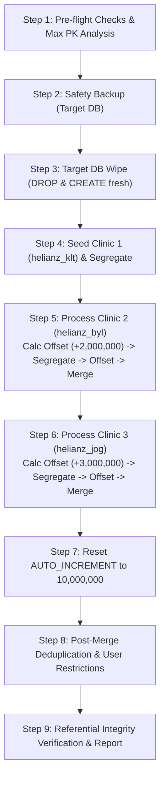

# Helianz Multi-Clinic Merge Toolkit
===================================

This directory contains the complete automated toolchain for merging independent clinic databases into a unified, multi-clinic Helianz database (`helianz`).

---

## 📁 File Manifest

| File | Type | Description |
|---|---|---|
| [`merge_mysql_clinics.py`](merge_mysql_clinics.py) | Python | **Master Orchestrator**: Executes full automated merge with target wipe, seeding, dynamic rounding offsets, autoinc bump, user deduplication, user clinic restrictions, and integrity verification. |
| [`Merge-ClinicsProduction.ps1`](Merge-ClinicsProduction.ps1) | PowerShell | **Production CLI Wrapper**: Interactive or scriptable PowerShell wrapper supporting parameters, dry-run, and secure password prompts. |
| [`merge_duplicate_users.py`](merge_duplicate_users.py) | Python | Finds duplicate usernames across clinics, re-links 14 tables (audit logs, documents, tasks, etc.), and consolidates clinic access. |
| [`segregate_clinic.py`](segregate_clinic.py) | Python | Moves unassigned `ClinicNum = 0` data to designated clinic and links providers/users. |
| [`offset_db.py`](offset_db.py) | Python | Offsets PKs and FKs by dynamic amount. Parses 738 FK relationships from `HelianzBusiness/TableTypes/*.cs`. |
| [`merge_clinics.py`](merge_clinics.py) | Python | Table-by-table migrator using `INSERT IGNORE`. |
| [`set_autoinc.py`](set_autoinc.py) | Python | Resets `AUTO_INCREMENT` to `10,000,000` on 390 operational, financial, and audit tables. |
| [`calc_offset.py`](calc_offset.py) | Python | Analyzes database max PKs and computes collision-free offset boundaries. |
| [`simulate_merge.py`](simulate_merge.py) | Python | Creates temporary sandbox copies to simulate a merge before running against production. |
| [`Fix-ApptViewAfterClinicSwitch.sql`](Fix-ApptViewAfterClinicSwitch.sql) | SQL | Fixes workstation `ApptView` assignments after clinic switching. |
| [`migrate_hybrid_media.py`](migrate_hybrid_media.py) | Python | **Cloud / Hybrid Media Migrator**: Organizes patient images/files in S3/iDrive e2 storage, calculates destination bucket folders, uses portable `rclone.exe`, loads `.env`, creates rclone profiles on the fly, and performs non-destructive parallel copies with dry-run audit reports. |
| [`rclone.exe`](rclone.exe) | Binary | **Portable Rclone**: Self-contained cloud storage sync executable used by media migration tools without requiring system-wide installation. |
| [`MULTI-CLINIC-GUIDE.md`](MULTI-CLINIC-GUIDE.md) | Markdown | Detailed architecture, table categorizations, and design documentation. |

---

## 🚀 Quick Start

### 1. Interactive Production Run (Recommended)
Prompted for password securely, automatically detects MariaDB/MySQL installation:
```powershell
.\Migration\MultiClinicMerge\Merge-ClinicsProduction.ps1 -TargetDb helianz -Sources "helianz_klt,helianz_byl,helianz_jog"
```

### 2. Dry-Run Preview
Check calculated offsets, database max PKs, and step plans without making any changes:
```powershell
.\Migration\MultiClinicMerge\Merge-ClinicsProduction.ps1 -TargetDb helianz -Sources "helianz_klt,helianz_byl,helianz_jog" -DryRun
```

### 3. Direct Python Execution
```bash
python Migration/MultiClinicMerge/merge_mysql_clinics.py --target helianz --sources helianz_klt,helianz_byl,helianz_jog -u root
```

---

## ⚙️ Merge Pipeline Phases



1. **Pre-flight**: Validates MariaDB credentials, verifies source databases exist, and calculates dynamic round-up offsets:
   $$\text{Offset} = \left\lceil \frac{\text{target\_max\_pk}}{1,000,000} \right\rceil \times 1,000,000$$
2. **Safety Backup**: Backs up target database into `Backups/` directory (can be skipped with `--skip-backup`).
3. **Clean Wipe**: Wipes target database clean (`DROP DATABASE` + `CREATE DATABASE utf8mb4`) and confirms 0 tables exist. (Bypass with `--no-wipe` if merging into an existing populated DB).
4. **Seed Clinic 1**: Seeds schema and records from Clinic 1 (`helianz_klt`), configures clinic table (`EasyNoClinics = 0`), and segregates `ClinicNum = 0` to Clinic 1.
5. **Sequential Processing**: For each subsequent clinic (`helianz_byl`, `helianz_jog`):
   - Clones source DB into an isolated temporary database `_tmp_merge_c<ClinicNum>_<timestamp>`.
   - Segregates records to that clinic.
   - Applies calculated round-up offset (+2M for Byl, +3M for Jog) across all clinic and patient tables.
   - Merges into target database via `INSERT IGNORE`.
   - Cleans up temporary database.
6. **Reset AUTO_INCREMENT**: Resets `AUTO_INCREMENT` across 390 operational, financial, and audit tables to **10,000,000**.
7. **Post-Merge Cleanups**:
   - **Workstation ComputerPref**: Deduplicates physical workstation rows.
   - **User Deduplication**: Merges duplicate accounts (e.g. `Admin`, `helianz`) and remaps 14 foreign-key tables (audit logs, documents, etc.).
   - **User Clinic Restrictions**:
     - Enforces `ClinicIsRestricted = 1` for all accounts.
     - Single-clinic users have access strictly to their originating clinic.
     - Multi-clinic users (e.g. `Admin` in Boyolali + Jogja) retain access strictly to their active clinics.
     - Configures `userodapptview` to only present views for permitted clinics.
   - **Preferences**: Deduplicates preference entries, keeping canonical settings.
8. **Verification**: Validates 0 orphan records across 7 referential integrity checks and generates user restriction audit report.

---

## 🔒 User Clinic Restriction Logic

Helianz uses Open Dental's multi-clinic security model:
- `userod.ClinicIsRestricted = 1`: User can only view and access clinics explicitly assigned in `userclinic`.
- `userclinic`: Defines which clinics a user can switch to.
- `userod.ClinicNum`: Defines the default clinic upon initial login.
- `userodapptview`: Defines the default appointment view for each clinic assigned to the user.

In `FormLogOn.cs`, the user list is dynamically filtered using `Userods.GetUserNamesNoCache(hasOnlyCEMT, selectedClinicNum)` so that switching the clinic dropdown only displays users permitted for that specific clinic.
